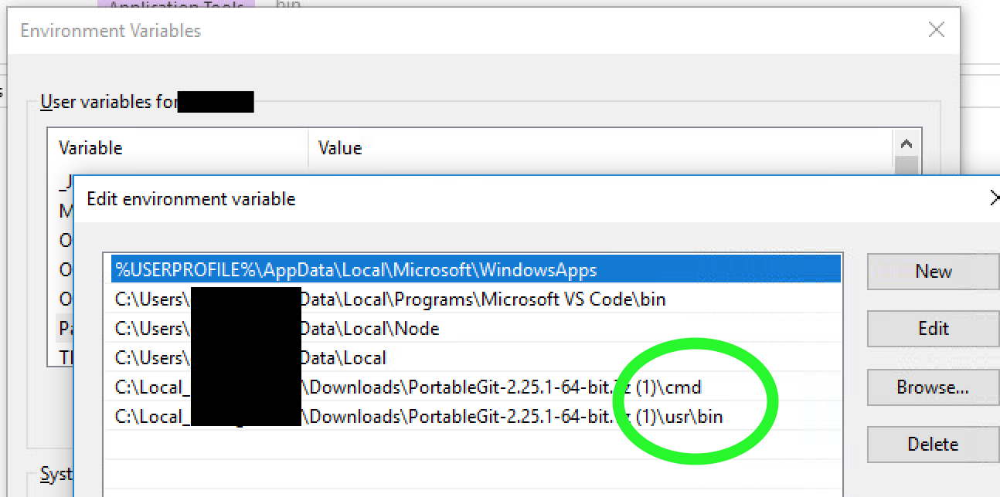

<!-- this has to be in the root folder as it is linked from an sgf2020 paper -->

# Windows

The reality for many SAS developers is that they are working in locked down windows machines without admin rights.  This causes problems when trying to install basic tooling such as GIT or NPM.

The correct approach in such circumstances is to simply make a request for these apps to be installed, so that you can be enabled to create amazing, supportable, maintainable web applications for your end users.

The alternative is to use portable versions that do not require admin privileges to execute.

!!! note
    If you are using powershell, and you don't have access to change your environment variables, you can add your paths to `$PROFILE` script `$env:Path`.  Thanks [Christopher Mortimer](https://www.linkedin.com/in/christopher-mortimer-286b1538/) for the tip!

VSCode
---------------------

VSCode is a powerful editor that includes a commandline that will run both CMD and POWERSHELL.  You can download the full version [here](https://code.visualstudio.com/download) or use the portable version [here](https://github.com/garethflowers/vscode-portable).

NPM
---------------------
Node Package Manager is an essential piece of kit, as it allows the dependencies of your project to be installed in a reproduceable manner.  You can download the full version [here](https://www.npmjs.com/get-npm), or - to install npm without admin rights:

1. visit the official [download page](https://nodejs.org/en/download) and extract the Windows Binary (zip file - not the installer).
2. Copy the contents to a filesystem location, eg `C:\Tools`.
3. Append the path (eg `C:\Tools;`) to the PATH variable in Environment Variables.  You can access the Environment Variables dialog, by right clicking on the Computer > Properties > Advanced system settings > Advanced tab > Environment Variables.
If you don’t have permission to access Environment Variables dialog, you can try the following command in the Run dialog:  `rundll32 sysdm.cpl,EditEnvironmentVariables`.

An alternative (perhaps more straightforward) approach is described here: [https://github.com/crazy-max/nodejs-portable](https://github.com/crazy-max/nodejs-portable)

GIT
---------------------

The full version of git can be downloaded [here](https://git-scm.com/downloads) or use the portable version [here](https://github.com/git-for-windows/git/releases) with the following instructions:

Download the portable `.exe` file from the [releases](https://github.com/git-for-windows/git/releases) page and unzip it to a location in your filesystem.

Inside the unzipped folder will be a folder called `cmd`. This contains the `git.exe` file.  There is also a `usr/bin` folder - which contains `ssh-keygen.exe`.

Add both of these locations to the PATH environment variable for your windows account, as per below.

Be sure to hit OK twice for the change to be saved!  You can now open a **new** shell window and create your SSH key using the `ssh-keygen` command.

### rsync

It's very handy to be able to rsync your local web content to the SAS web server.  The git bash shell does not come with rsync by default.  A guide to installing it (using git bash) is available [here](https://gist.github.com/hisplan/ee54e48f17b92c6609ac16f83073dde6#gistcomment-3462247)

CMDer
---------------------

This comes prebundled with GIT, allows a number of unix commands, and enables a remote (cloud) config, worth checking out:  https://cmder.net/
